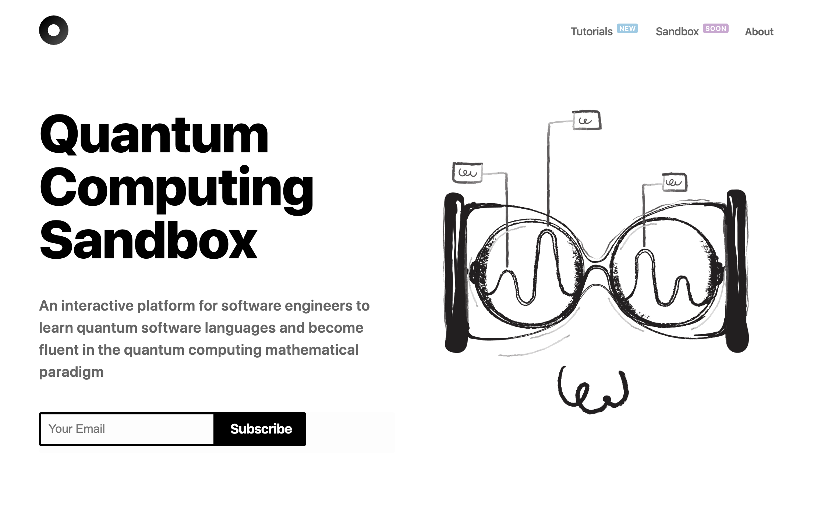

# QC Sandbox Website

<p align="center">

</p>

## Development

### Installation

Install it and run:

```bash
npm install
npm run dev
```

# or

```bash
yarn
yarn dev
```

Open in your browser at [localhost:3000](https://localhost:3000).

### Deployment

Deploy it to the cloud with [now](https://zeit.co/now) ([download](https://zeit.co/download))

```bash
now
```

---

## Creating new posts

- Posts are maintained at our [qcsanbox_tutorials repo](https://github.com/wearecuriee/qcsandbox_tutorials).
- Images for the posts can be created at our fork of [og-image](https://og-image.qcsandbox.com/).
